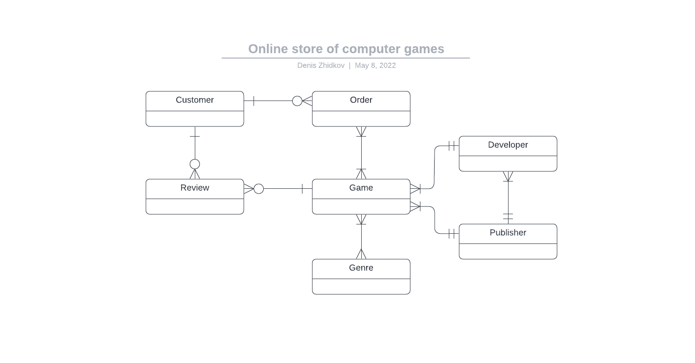

# Лабораторная работа №1.1. Разработка структуры БД

## Цели работы
Познакомиться с основами проектирования схемы БД, способами организации данных в SQL-БД.

## Программа работы
1. Выбор задания (предметной области), описание набора данных и требований к хранимым данным.
2. Формирование схемы БД, соответствующей заданию. Должно получиться не менее 7 таблиц.
3. Обоснование принятых решений и соответствия требованиям выбранного задания.

## Ход работы

### Описание предметной области
В качестве предметной области мною был выбран онлайн-магазин компьютерных игр. Опишу таблицы, которые будут являться структурой данной БД.

**Customer** (Покупатель) - пользователь онлайн-магазина
  
    id - индетификатор пользователя
    login - логин пользователя
    password - пароль пользователя
    email - почта, указанная при регистрации

**Order** (Заказ) - заказ на одну/несколько игр определённого пользователя
    
    id - индетификатор заказа
    customer_id - индефикатор пользователя, сделавшего заказ
    game_id - индетификатор/индетификаторы заказанной/заказанных игры/игр
    date - дата заказа

**Game** (Игра) - информация об игре

    id - индетификатор игры
    genre_id - индетификаторы жанров, к которой принадлежит игра
    developer_id - индетификатор разработчика, который создал игру
    publisher_id - индетификаторы издателей, издавших игру
    name - название игры
    price - стоимость игры
    description - описание игры

**Review** (Отзыв) - отзыв об игре
    
    id - индетификатор отзыва
    customer_id - индетификатор пользователя, оставившего отзыв
    game_id - индетификатор игры, к которой относится отзыв
    rate - оценка игры
    text - тескт отзыва

**Genre** (Жанр) - информация о жанре игры
    
    id - индетификатор жанра
    name - название жанра
    popularity - популярность жанра

**Developer** (Разработчик) - информация о разработчике игры

    id - индетификатор разработчика
    publisher_id - индетификаторы издателей, с которыми работает разработчик
    name - название компании разработчика
    country - страна разработчика
    found_date - дата основания компании разработчика
    game_count - количество, выпщуенных разработчиком игр

**Publisher** (Издатель) - информация об издателе игры
    
    id - индетификатор издателя
    name - название компании издателя
    country - страна издателя
    found_date - дата основания компании издателя
    game_count - количество, выпущенных под данным издательством игр

### Формирование схемы БД

Ниже представлены две схемы проектируемой базы данных: концептуальная и даталогическая ER-диаграммы.

**Концептуальная ER-диаграмма**

**Даталогическая ER-диаграмма**

Прокомментирую некоторые принятые при составлении диаграмм решения:

- Некоторые покупатели могут не иметь ни одного заказа и ни одного отзыва, однако также возможна ситуация,
когда у пользователя могут быть только отзывы или только заказы. Естественно возможна и ситуация, когда у пользователя
есть как заказы, так и отзывы.
- Любая игра относиться к более, чем одному жанру.
- У одной игры может быть только один разработчик, но, к примеру, в зависимости от страны разный издатель.
- Из предыдущего пункта следует, что один разработчик может сотрудничать с несколькими издательствами. Но есть и
разработчики, выпускающие игры без издательств.
- Отдельный отзыв может относиться только к одной игре, но у одной игры может быть более одного отзыва, а может и не
быть их вообще.

### Вывод
В данной лабораторной работе мы познакомились со способами проектирования БД, способами организации данных, составления
ER-диаграмм. По результатам лабораторной работы было составлено задание по проектированию SQL базы данных, спроектирована
её схема. Также получены навыки работы с инструментами работы над ER-диаграммами.