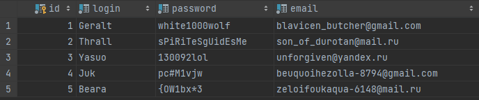
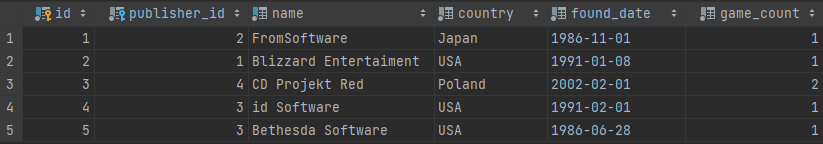
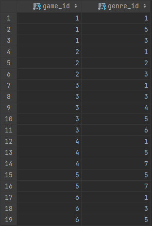
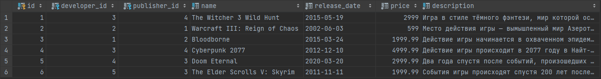
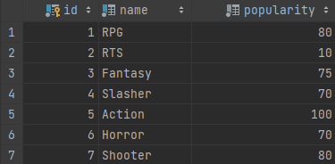
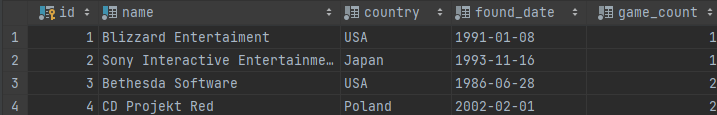
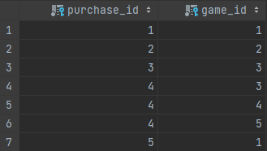
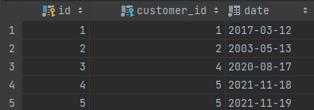
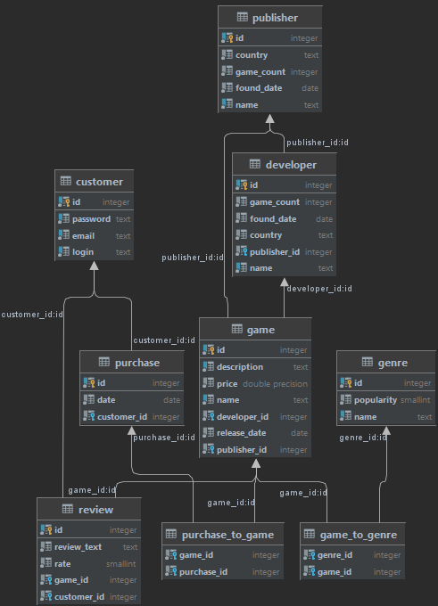

# Лабораторная работа №1.2. Язык SQL DDL

## Цели работы

Познакомиться с основами проектирования схемы БД, языком описания сущностей и ограничений БД SQL-DDL.

## Программа работы

1. Создание скрипта БД в соответствии с согласованной схемой. Должны присутствовать первичные и внешние ключи,
   ограничения на диапазоны значений. Демонстрация скрипта преподавателю.
2. Создание скрипта, заполняющего все таблицы БД данными.
3. Выполнение SQL-запросов, изменяющих схему созданной БД по заданию преподавателя. Демонстрация их работы
   преподавателю.

## Ход работы

### Создание скрипта, создающего БД

Скрипт по созданию БД находится в подпроекте store_bd по пути src/resources/main/resources/db-scripts/initDB.sql. Его код
представлен ниже:

```sql
-- Создание базы
CREATE DATABASE computer_games_store;

-- Создание таблиц
CREATE TABLE customer
(
    id       serial PRIMARY KEY,
    login    text NOT NULL UNIQUE,
    password text NOT NULL UNIQUE,
    email    text NOT NULL UNIQUE
);

CREATE TABLE publisher
(
    id         serial PRIMARY KEY,
    name       text    NOT NULL UNIQUE,
    country    text    NOT NULL,
    found_date DATE    NOT NULL,
    game_count INTEGER NOT NULL
);

CREATE TABLE genre
(
    id         serial PRIMARY KEY,
    name       text                                                   NOT NULL UNIQUE,
    popularity SMALLINT CHECK (popularity <= 100 and popularity >= 0) NOT NULL
);

CREATE TABLE developer
(
    id           serial PRIMARY KEY,
    publisher_id serial REFERENCES publisher (id),
    name         text    NOT NULl UNIQUE,
    country      text    NOT NULL,
    found_date   DATE    NOT NULL,
    game_count   INTEGER NOT NULL
);

CREATE TABLE game
(
    id           serial PRIMARY KEY,
    developer_id serial REFERENCES developer (id) NOT NULL,
    publisher_id serial REFERENCES publisher (id) NOT NULL,
    name         text                             NOT NULL UNIQUE,
    release_date DATE                             NOT NULL,
    price        DOUBLE PRECISION                 NOT NULL,
    description  text UNIQUE                      NOT NULL
);

CREATE TABLE game_to_genre
(
    game_id  serial REFERENCES game (id)  NOT NULL,
    genre_id serial REFERENCES genre (id) NOT NULL
);

CREATE TABLE purchase
(
    id          serial PRIMARY KEY,
    customer_id serial REFERENCES customer (id) NOT NULL,
    date        DATE                            NOT NULL
);

CREATE TABLE purchase_to_game
(
    purchase_id serial REFERENCES purchase (id) NOT NULL,
    game_id     serial REFERENCES game (id)     NOT NULL
);

CREATE TABLE review
(
    id          serial PRIMARY KEY,
    customer_id serial REFERENCES customer (id)           NOT NULL,
    game_id     serial REFERENCES game (id)               NOT NULL,
    rate        SMALLINT CHECK (rate <= 10 and rate >= 0) NOT NULL,
    review_text text                                      NOT NULL
)
```

Отмечу, что таблицы *purchase_to_game* и *game_to_genre* необходимы для обеспечения удобной связи многие-ко-многим.
Также можно заметить, что помимо стандартных типов данных SQL таких, как *SMALLINT* или *DATE*, я использую типы данных
предоставляемы PostgreSQL (базы данных, которую я использую) таких, как *serial* или *text*.

### Создание скрипта, заполняющего БД данными

Данный скрипт находится всё в том же подпроекте и в той же директории, но его название fillDBWithDummyData.sql.
Его код представлен ниже:
```sql
INSERT INTO customer (login, password, email)
VALUES ('Geralt', 'white1000wolf', 'blavicen_butcher@gmail.com'),
       ('Thrall', 'sPiRiTeSgUidEsMe', 'son_of_durotan@mail.ru'),
       ('Yasuo', '130092lol', 'unforgiven@yandex.ru'),
       ('Juk', 'pc#M1vjw', 'beuquoihezolla-8794@gmail.com'),
       ('Beara', '{OW1bx*3', 'zeloifoukaqua-6148@mail.ru');

INSERT INTO publisher (name, country, found_date, game_count)
VALUES ('Blizzard Entertaiment', 'USA', '08.01.1991', 1),
       ('Sony Interactive Entertainment', 'Japan', '16.11.1993', 1),
       ('Bethesda Software', 'USA', '28.06.1986', 2),
       ('CD Projekt Red', 'Poland', '01.02.2002', 2);

INSERT INTO genre (name, popularity)
VALUES ('RPG', 80),
       ('RTS', 10),
       ('Fantasy', 75),
       ('Slasher', 70),
       ('Action', 100),
       ('Horror', 70),
       ('Shooter', 80);

INSERT INTO developer (publisher_id, name, country, found_date, game_count)
VALUES (2, 'FromSoftware', 'Japan', '01.11.1986', 1),
       (1, 'Blizzard Entertaiment', 'USA', '08.01.1991', 1),
       (4, 'CD Projekt Red', 'Poland', '01.02.2002', 2),
       (3, 'id Software', 'USA', '01.02.1991', 1),
       (3, 'Bethesda Software', 'USA', '28.06.1986', 1);

INSERT INTO game (developer_id, publisher_id, name, release_date, price, description)
VALUES (3, 4, 'The Witcher 3 Wild Hunt', '19.05.2015', 2999.00,
        'Игра в стиле тёмного фэнтези, мир которой основан на славянской мифологии...'),
       (2, 1, 'Warcraft III: Reign of Chaos', '03.06.2002', 599.00,
        'Место действия игры — вымышленный мир Азерот. За несколько лет до событий игры...'),
       (1, 2, 'Bloodborne', '24.03.2015', 1999.99,
        'Действие игры начинается в охваченном эпидемией чумы вымышленном городе Ярнам...'),
       (3, 4, 'Cyberpunk 2077', '10.12.2012', 4999.99,
        'Действие игры происходит в 2077 году в Найт-Сити, вымышленном мегаполисе на западном побережье Северной Америки...'),
       (4, 3, 'Doom Eternal', '20.03.2020', 2999.99,
        'Два года спустя после событий, произошедших на Марсе, Земля почти полностью захвачена демоническими силами...'),
       (5, 3, 'The Elder Scrolls V: Skyrim', '11.11.2011', 1999.99,
        'События игры происходят спустя 200 лет после событий Oblivion в 201 году 4-й эры...');

INSERT INTO game_to_genre (game_id, genre_id)
VALUES (1, 1),
       (1, 5),
       (1, 3),
       (2, 1),
       (2, 2),
       (2, 3),
       (3, 1),
       (3, 3),
       (3, 4),
       (3, 5),
       (3, 6),
       (4, 1),
       (4, 5),
       (4, 7),
       (5, 5),
       (5, 7),
       (6, 1),
       (6, 3),
       (6, 5);

INSERT INTO purchase (customer_id, date)
VALUES (1, '12.03.2017'),
       (2, '13.05.2003'),
       (4, '17.08.2020'),
       (5, '18.11.2021'),
       (5, '19.11.2021');

INSERT INTO purchase_to_game (purchase_id, game_id)
VALUES (1, 1),
       (2, 2),
       (3, 3),
       (4, 3),
       (4, 4),
       (4, 5),
       (5, 1);

INSERT INTO review (customer_id, game_id, rate, review_text)
VALUES (1, 1, 10, 'Лучшая игра'),
       (2, 2, 10, 'Прекрасный сюжет'),
       (3, 1, 2, 'Не зашло'),
       (4, 5, 8, 'Неплохо');
```

Также для удобства был создан скрипт полностью удаляющий все таблицы и удаляющий саму БД.
Его код представлен ниже:
```sql
-- Удаляем таблицы
DROP TABLE IF EXISTS customer CASCADE;
DROP TABLE IF EXISTS publisher CASCADE;
DROP TABLE IF EXISTS genre CASCADE;
DROP TABLE IF EXISTS developer CASCADE;
DROP TABLE IF EXISTS game CASCADE;
DROP TABLE IF EXISTS game_to_genre CASCADE;
DROP TABLE IF EXISTS purchase_to_game CASCADE;
DROP TABLE IF EXISTS purchase CASCADE;
DROP TABLE IF EXISTS review CASCADE;

-- Удаляем базу
DROP DATABASE computer_games_store;
```

### Результаты 
В результате выполнения первых двух скриптов получаем следующие таблицы и схему.

**Таблица пользователей**



**Таблица разработчиков**



**Таблица игры-к-жанру**



**Таблица игр**



**Таблица жанров**



**Таблица издателей**



**Таблица заказ-к-игре**



**Таблица заказов**



**Полученная схема БД**



### Вывод
В данной лабораторной работе мы познакомились с основами проектирования схемы БД, языком описания сущностей и ограничений БД SQL-DDL.
Также были использованы некоторые возможности PostgreSQL. В результате была спроектирована БД согласно заданию.

