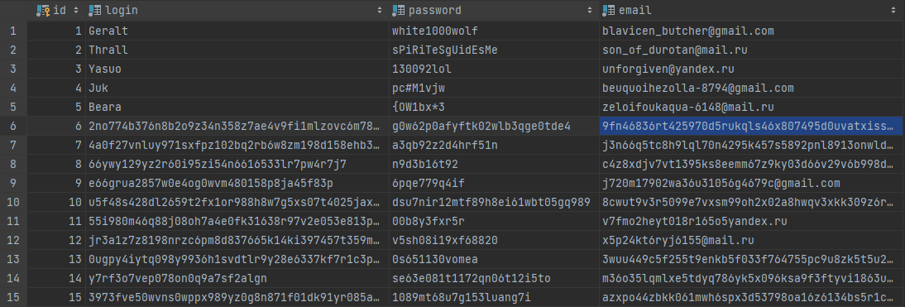
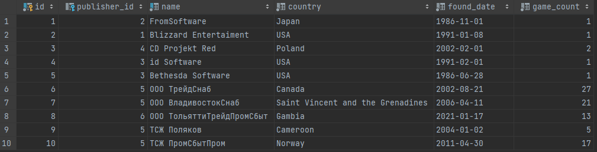
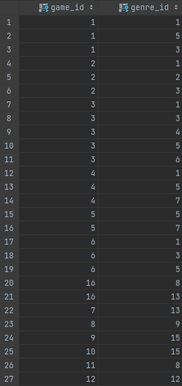
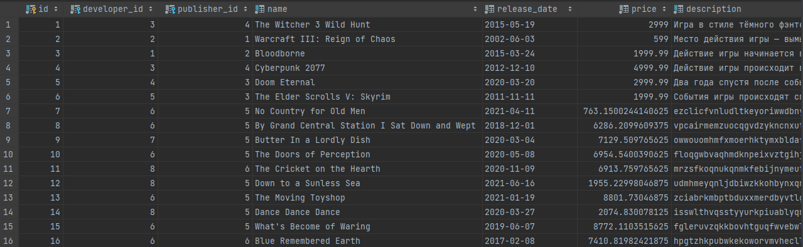
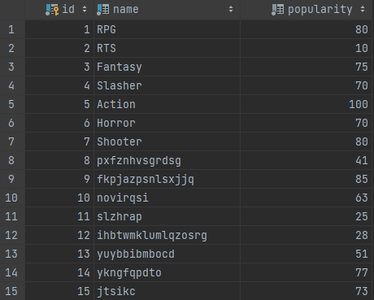
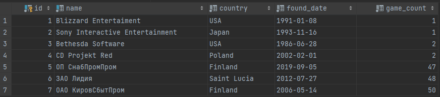
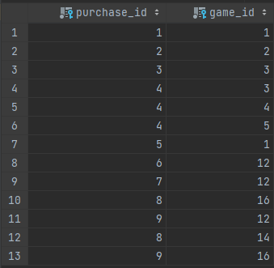
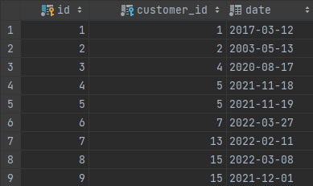

# Лабораторная работа №2. Генерация тестовых данных

## Цели работы

Сформировать набор данных, позволяющий производить операции на реальных объемах данных.

## Программа работы

1. Реализация в виде программы параметризуемого генератора, который позволит сформировать набор связанных данных в
   каждой таблице.
2. Частные требования к генератору, набору данных и результирующему набору данных:

* количество записей в справочных таблицах должно соответствовать ограничениям предметной области
* количество записей в таблицах, хранящих информацию об объектах или субъектах должно быть параметром генерации
* значения для внешних ключей необходимо брать из связанных таблиц
* сохранение уже имеющихся данных в базе данных

## Ход работы

### Используемые инструменты

Для реализации генератора мною использовался следующий инструментарий:

* Язык программирования - Java
* Драйвер - JDBC
* Библиотека для генерации тестовых данных - [Faker](https://github.com/DiUS/java-faker)

### Структура проекта

Проект можно разделить на три части:

1. Пакет entities - в нём расположены классы, отвечающие за создаваемые таблицы и их содержимое
   (по сути обычные data классы, хранящие строки определённой таблицы, а также get-еры для них).
2. Пакет generators - в нём расположены классы-генераторы, каждый для своей таблицы. Подробнее об их работе в пункте "
   Работа генератора".
3. Классы Initiator и Main - Initiator отвечает за последовательную вставку в нужном порядке таблиц в БД, а класс Main -
   входная точка программы.

### Работа генератора

Алгоритм работы генератора начинается из класса Main, где происходит инициализация подключения к БД, после чего
создаётся объект класса Initiator, у которого вызывается метод *insertRandomData()*. В данный метод задаются параметры
по количеству записей для каждой из таблиц (в данный момент это вставка 10 покупателей, 8 жанров, 3 издателей, 5
разработчиков, 10 игр, 4 заказов и 5 отзывов).

При создании объекта *Initiator* создаётся объект *GeneratorChooser*, который будет отвечать за выбор необходимого в
данный момент генерации генератора, а также подавать необходимые данные в них (к примеру, сгенерированные после
предыдущей вставки id). Вставка выстроена следующим образом (из-за того что одни таблицы зависят от полей других):
*Customers -> Genres -> Publishers -> Developers -> Games -> Orders -> Reviews -> GamesToGenres -> OrdersToGames*. Чтобы
инициировать вставку в определённую таблицу в методе *insertRandomData()* вызывается соответствующий метод вставки
(к примеру, для таблицы *Customers* это будет *insertCustomers()*), в котором происходит сначала генерация данных и
затем с помощью *PreparedStatement* и команды *INSERT INTO* вставка в таблицу.

Сама генерация начинается с вызова *GeneratorChooser* определённого генератора и вызова у него определённого метода
*generateMultiply()*. Все генераторы наследуются от абстрактного класса *Generator* и реализуют метод *generate*,
который используется в *generateMultiply()* по своему, в зависимости от того, какие данные нужно сгенерировать. Также в
методе *Generator* есть некоторые другие методы, которые часто используются при генерации, из-за чего вынесены в
родительский класс. Методы *insert-ы* иногда возвращают некоторые *list-ы* или *map-ы* со сгенерированными данными,
которые передаются другим генераторам для реализации их алгоритма. Немного от общего алгоритма генерации отличается
генерация *GamesToGenres* и *OrdersToGames*. Сначала для каждой игры или заказа обязательно задаётся жанр или игра
соответственно, а после чего добавляются дополнительные строки для имитации связи многие-ко-многим.

### Результаты генерации

Ниже представлены таблицы, сгенерированные с использованием данной программы.

**Таблица пользователей**

**Таблица разработчиков**

**Таблица игры-к-жанру**

**Таблица игр**

**Таблица жанров**

**Таблица издателей**

**Таблица заказ-к-игре**

**Таблица заказов**

## Вывод
В результате выполнения данной лабораторной работы был спроектирован генератор смешанных данных для заполнения таблиц БД.
Данный генератор отвечает всем указанным в программе работы требованиям и позволяет генерировать множество данных для 
заполнения таблиц. Также были изучены способы взаимодействия с БД с помощью языка программирования Java и драйвера JDBC,
изучена библиотека генерации тестовых данных Faker.