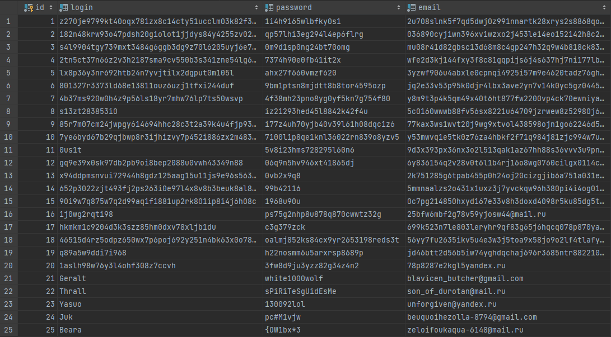

# Лабораторная работа №3. Генерация тестовых данных

## Цели работы

Познакомить студентов с языком создания запросов управления данными SQL-DML.

## Программа работы

1. Изучение SQL-DML.
2. Выполнение всех запросов из списка стандартных запросов. Демонстрация результатов преподавателю.
3. Получение у преподавателя и реализация SQL-запросов в соответствии с индивидуальным заданием. Демонстрация
   результатов преподавателю.
4. Сохранение в БД выполненных запросов SELECT в виде представлений, запросов INSERT, UPDATE или DELETE -- в виде ХП.
   Выкладывание скрипта в GitLab.

### Список стандартных запросов

* Сделайте выборку всех данных из одной таблицы
* Сделайте выборку данных из одной таблицы при нескольких условиях, с использованием логических операций, LIKE, BETWEEN,
  IN (не менее 3-х разных примеров)
* Создайте в запросе вычисляемое поле
* Сделайте выборку всех данных с сортировкой по нескольким полям
* Создайте запрос, вычисляющий несколько совокупных характеристик таблиц
* Сделайте выборку данных из связанных таблиц (не менее двух примеров)
* Создайте запрос, рассчитывающий совокупную характеристику с использованием группировки, наложите ограничение на
  результат группировки
* Придумайте и реализуйте пример использования вложенного запроса
* С помощью оператора UPDATE измените значения нескольких полей у всех записей, отвечающих заданному условию
* С помощью оператора DELETE удалите запись, имеющую максимальное (минимальное) значение некоторой совокупной
  характеристики
* С помощью оператора DELETE удалите записи в главной таблице, на которые не ссылается подчиненная таблица (используя
  вложенный запрос)

## Ход работы

Перед тем, как начать работу я пересоздал все таблицы и добавил в них дополнительных данных для наглядности выполняемых
запросов. Посмотрим на полученные таблицы.

**Таблица пользователей**



**Таблица разработчиков**


**Таблица игры-к-жанру (Часть 1)**


**Таблица игры-к-жанру (Часть 2)**


**Таблица игр**


**Таблица жанров**


**Таблица издателей**


**Таблица заказ-к-игре**


**Таблица заказов**


Далее буду выполнять приведённые выше запросы в виде кода для этого запроса и полученных результатов. Все данные запросы
хранятся в файле interactDB.

```sql
-- 1. Все записи из таблицы publisher
SELECT *
FROM publisher;
```

**Результат**


```sql
-- 2.1. id отзыва, где оценка выше или равна 5
SELECT id, rate
FROM review
WHERE rate BETWEEN '5' AND '10';
```

**Результат**


```sql
-- 2.2. Разработчики, чьи имена начинаются с ООО
SELECT id, name
FROM developer
WHERE name LIKE 'НКО%';
```

**Результат**


```sql
-- 2.3. Игры изданные с 2020 по 2022, не от издателей с id 1, 5 и 6
SELECT publisher_id, name, release_date
FROM game
WHERE release_date BETWEEN '2020-01-01' AND '2022-01-01'
  AND publisher_id NOT IN (1, 5, 6);
```

**Результат**


```sql
-- 3. Получить логины юзеров и длину их паролей
SELECT login, LENGTH(password)
FROM customer;
```

**Результат**


```sql
-- 4. Все записи из таблицы game отсортированные по названию (по алфавиту) и по дате выпуска (по возрастанию)
SELECT *
FROM game
ORDER BY (name, release_date);
```

**Результат**


```sql
-- 5. Максимальная, минимальная и средняя цена всех игр
SELECT MAX(price), MIN(price), AVG(price)
FROM game;
```

**Результат**


```sql
-- 6.1. Название игры, у которых есть оценка, название разработчика и оценка
SELECT g.name, d.name, r.rate
FROM game as g
         JOIN developer d on d.id = g.developer_id
         JOIN review r on r.game_id = g.id
ORDER BY (g.name);
```

**Результат**


```sql
-- 6.2. Имя игры, дата заказа и логин заказавшего
SELECT g.name, p.date, c.login
FROM purchase as p
         JOIN customer c on p.customer_id = c.id
         JOIN purchase_to_game ptg on ptg.purchase_id = p.id
         JOIN game g on ptg.game_id = g.id
ORDER BY (g.name);
```

**Результат**


```sql
-- 7. Кол-во жанров у 5 игр
SELECT g.name, COUNT(*)
FROM game as g
         JOIN game_to_genre gtg on g.id = gtg.game_id
         JOIN genre gen on gtg.genre_id = gen.id
GROUP BY (g.name), g.name
ORDER BY g.name
LIMIT 5;
```

**Результат**


```sql
-- 8. Получение логинов юзеров, которые приобрели новинки.
SELECT ld.login
FROM (
         SELECT c.login, g.name, g.release_date
         FROM customer as c
                  JOIN purchase p on c.id = p.customer_id
                  JOIN purchase_to_game ptg on p.id = ptg.purchase_id
                  JOIN game g on ptg.game_id = g.id
         WHERE g.release_date BETWEEN '2020-01-01' AND '2022-01-01'
     ) as ld
ORDER BY (ld.login);
```

**Результат**


```sql
-- 9. Сменить страну разработчика на Russia и количество выпущенных игр на 100, если его название начинается с ООО или
-- ТСЖ
UPDATE developer
SET country    = 'Russia',
    game_count = 100
WHERE name LIKE 'ООО%'
   OR name LIKE 'ТСЖ%';
```

**Результат**


```sql
-- 10. Удалить ревью с минимальной оценкой
DELETE
FROM review
WHERE rate = (
    SELECT MIN(rate)
    FROM review
);
```

**Результат**


```sql
-- 11. Удалить всех покупателей, у которых нет ни заказов ни ревью
DELETE
FROM customer
WHERE id NOT IN (
    SELECT customer_id
    FROM purchase
)
  AND id NOT IN (
    SELECT customer_id
    FROM review
);
```

**Результат**


### Вывод

В данной лабораторной работе мы познакомились с языком создания запросов управления данными SQL-DML. Было создано 14
различных запросов, включающих запросы с вычисляемыми характеристиками, запросы с подзапросами, запросы из связных
таблиц, запросы на UPDATE и DELETE и другие.
