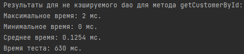
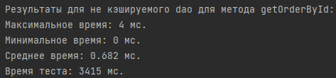
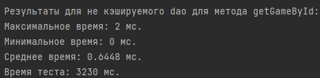
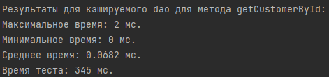
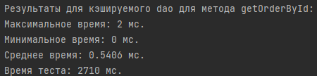
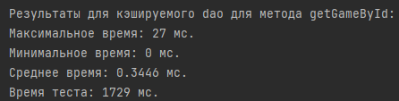
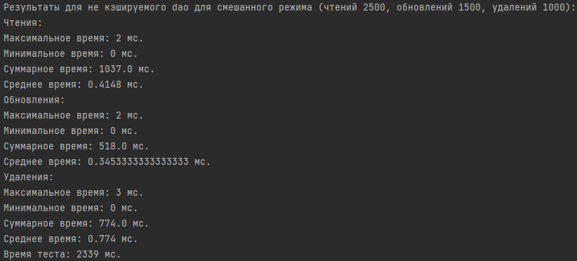
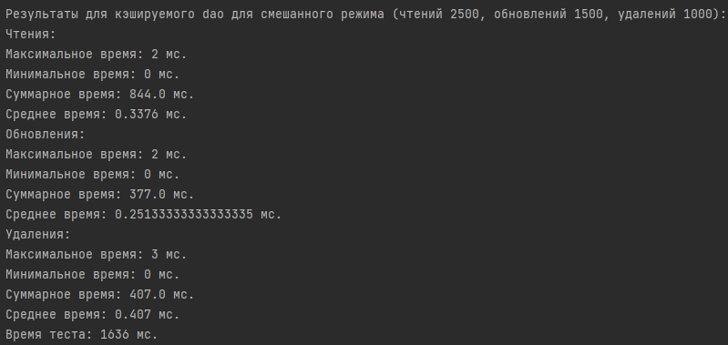

# Лабораторная работа №4. Кэширование

### Цели работы

Знакомство студентов с алгоритмами кэширования. В рамках данной работы необходимо разработать кэширующий SQL-proxy -
программу, которая принимала бы запросы к БД, отправляла эти запросы в БД, сохраняла бы результаты в хранилище. Если
приходит повторный запрос на чтение - выдавала запросы из хранилища, если приходит запрос на изменение - сбрасывала бы
значения всех запросов, результаты которых станут неактуальными после внесенных изменений.

### Программа работы

1. Общее описание:
    - для данной работы необходимо выбрать часть таблиц БД (3+), для которой можно придумать/использовать осмысленные
      SQL-запросы, необходимые для выполнения пользовательских функций
    - в рамках работы необходимо реализовать две программы: кэширующий прокси и программа для выполнения запросов и
      измерения результатов
2. Выбор понравившегося способа кэширования
    - в памяти программы
    - с использованием внешних хранилищ
    - во внешней памяти
3. Реализация выбранного способа
    - преобразование входных запросов
    - выбор ключа для хранения результатов
    - реализация алгоритма поиска сохраненных результатов, которые надо сбросить после внесения изменений в БД
4. Снятие показательных характеристик
    - в программе для формирования потока запросов к БД на чтение/изменение/удаление должна быть возможность настройки
      соотношения запросов, количества запросов разных типов в потоке и измерения временных характеристик:
      среднее/минимальное/максимальное время выполнения запроса по типу, необходимо иметь возможность проанализировать
      эффективность кэширования в различных сценариях: преимущественно чтение, преимущественно изменение,
      преимущественно удаление измерения можно производить путем простого сравнения отметок текущего времени до и после
      выполнения запросов
5. Анализ полученных результатов и сравнение реализаций с кэшем и без между собой.
6. Демонстрация результатов преподавателю.

### Ход работы

#### Выбор таблиц

В качестве таблиц, для которых реализовывалась работа мною был выбраны таблицы *customer*, *purchase* и *game*. Для них
реализованы следующие запросы приближённые к реальным.

- getCustomerById - получение логина, пароля и email покупателя по id
- getGameById - получение всех характеристик таблицы game, а также имени разработчика и издателя и списка жанров, к
  которой принадлежит игра по id
- getOrderById - получение всех характеристик таблицы purchase, а также логина покупателя и списка названий
  приобретённых игр
- updateOrderDate - обновление даты заказа
- updateCustomerPassword - обновление пароля покупателя
- deleteOrderById - удаление заказа по id
- deleteCustomerById - удаление покупателя по id

#### Реализация

Перед тем, как перейти к реализации самого задания стоит отметить, что мною были расширены классы таблиц *Game*, *Order*
*Customer* для хранения дополнительной информации, получаемой из запросов. Также пришлось прибегнуть к изменениям в
*PublisherGenerator*, *DeveloperGenerator*, *GameGenerator*, поскольку библиотека Faker не предоставляет достаточного
количества уникальных имён для некоторых полей.

Для начала был написан DAO (Data Access Object) интерфейс, в котором были описаны все методы, упомянутые выше.

```java
public interface Dao {

    Customer getCustomerById(long id);

    Game getGameById(long id);

    Order getOrderById(long id);

    void updateOrderDate(long id, LocalDate date);

    void updateCustomerPassword(long id, String password);

    void deleteOrderById(long id);

    void deleteCustomerById(long id);
}
```

От данного интерфейса наследуются класс NonCashingDao, который реализует данные методы без подхода с кэшированием.

```java
public class NonCachingDao implements Dao {

    private final Connection connection;

    public NonCachingDao(Connection connection) {
        this.connection = connection;
    }

    // Имитация реального запроса
    @Override
    public Customer getCustomerById(long id) {
        try {
            PreparedStatement preparedStatement = connection.prepareStatement(
                    "SELECT * " +
                            "FROM customer " +
                            "WHERE id = ?"
            );
            preparedStatement.setLong(1, id);
            try (ResultSet resultSet = preparedStatement.executeQuery()) {
                if (resultSet.next()) {
                    String login = resultSet.getString("login");
                    String password = resultSet.getString("password");
                    String email = resultSet.getString("email");
                    return new Customer(id, login, password, email);
                }
            }
        } catch (SQLException e) {
            throw new IllegalStateException(e);
        }
        return null;
    }

    // Имитация реального запроса
    @Override
    public Game getGameById(long id) {
        try {
            PreparedStatement preparedStatement = connection.prepareStatement(
                    "SELECT *, d.name as developer_name, p.name as publisher_name, gen.name as genre_name " +
                            "FROM game g " +
                            "JOIN developer d on g.developer_id = d.id " +
                            "JOIN publisher p on g.publisher_id = p.id " +
                            "JOIN game_to_genre gtg on g.id = gtg.game_id " +
                            "JOIN genre gen on gtg.genre_id = gen.id " +
                            "WHERE g.id = ?"
            );
            preparedStatement.setLong(1, id);
            try (ResultSet resultSet = preparedStatement.executeQuery()) {
                if (resultSet.next()) {
                    long developerId = resultSet.getLong("developer_id");
                    long publisherId = resultSet.getLong("publisher_id");
                    String name = resultSet.getString("name");
                    LocalDate releaseDate = resultSet.getDate("release_date").toLocalDate();
                    float price = resultSet.getFloat("price");
                    String description = resultSet.getString("description");
                    String developerName = resultSet.getString("developer_name");
                    String publisherName = resultSet.getString("publisher_name");

                    Game game = new Game(
                            id,
                            developerId,
                            publisherId,
                            developerName,
                            publisherName,
                            name,
                            releaseDate,
                            price,
                            description);

                    game.addToListOfGenres(resultSet.getString("genre_name"));
                    while (resultSet.next()) {
                        game.addToListOfGenres(resultSet.getString("genre_name"));
                    }
                    return game;
                }
            }
        } catch (SQLException e) {
            throw new IllegalStateException(e);
        }
        return null;
    }

    // Имитация реального запроса
    @Override
    public Order getOrderById(long id) {
        try {
            PreparedStatement preparedStatement = connection.prepareStatement(
                    "SELECT *, c.login as customer_login, g.name as game_name " +
                            "FROM purchase p " +
                            "JOIN customer c on c.id = p.customer_id " +
                            "JOIN purchase_to_game ptg on p.id = ptg.purchase_id " +
                            "JOIN game g on ptg.game_id = g.id " +
                            "WHERE p.id = ?"
            );
            preparedStatement.setLong(1, id);
            try (ResultSet resultSet = preparedStatement.executeQuery()) {
                if (resultSet.next()) {
                    long customerId = resultSet.getLong("customer_id");
                    LocalDate date = resultSet.getDate("date").toLocalDate();
                    String customerLogin = resultSet.getString("customer_login");

                    Order order = new Order(id, customerId, customerLogin, date);

                    order.addToListOfGames(resultSet.getString("game_name"));
                    while (resultSet.next()) {
                        order.addToListOfGames(resultSet.getString("game_name"));
                    }
                    return order;
                }
            }
        } catch (SQLException e) {
            throw new IllegalStateException(e);
        }
        return null;
    }

    @Override
    public void updateOrderDate(long id, LocalDate date) {
        try {
            PreparedStatement preparedUpdateStatement = connection.prepareStatement(
                    "UPDATE purchase SET date = ? WHERE id = ?"
            );
            preparedUpdateStatement.setDate(1, Date.valueOf(date));
            preparedUpdateStatement.setLong(2, id);
            preparedUpdateStatement.executeUpdate();
        } catch (SQLException e) {
            throw new IllegalStateException(e);
        }
    }

    @Override
    public void updateCustomerPassword(long id, String password) {
        try {
            PreparedStatement preparedStatement = connection.prepareStatement(
                    "UPDATE customer SET password = ? WHERE id = ? "
            );
            preparedStatement.setString(1, password);
            preparedStatement.setLong(2, id);
            preparedStatement.executeUpdate();
        } catch (SQLException e) {
            throw new IllegalStateException(e);
        }
    }

    @Override
    public void deleteOrderById(long id) {
        try {
            PreparedStatement preparedStatement = connection.prepareStatement("DELETE FROM purchase WHERE id = ?");
            preparedStatement.setLong(1, id);
            preparedStatement.executeUpdate();
        } catch (SQLException e) {
            throw new IllegalStateException(e);
        }
    }

    @Override
    public void deleteCustomerById(long id) {
        try {
            PreparedStatement preparedStatement = connection.prepareStatement("DELETE FROM customer WHERE id = ?");
            preparedStatement.setLong(1, id);
            preparedStatement.executeUpdate();
        } catch (SQLException e) {
            throw new IllegalStateException(e);
        }
    }
}
```

От данного класса уже наследуется класс CachedDao, где методы расширяются таким образом, что для каждой таблицы (из выше
описанных) выделяется свой LRU-кэш (упрощённый), и добавляется логика добавление записей туда.

```java
public class CachedDao extends NonCachingDao {

    private final LRUCache<Long, Customer> customerCache;
    private final LRUCache<Long, Game> gameCache;
    private final LRUCache<Long, Order> orderCache;

    public CachedDao(Connection connection, int maxCacheSizeForOneTable) {
        super(connection);
        this.customerCache = new LRUCache<>(maxCacheSizeForOneTable);
        this.gameCache = new LRUCache<>(maxCacheSizeForOneTable);
        this.orderCache = new LRUCache<>(maxCacheSizeForOneTable);
    }

    @Override
    public Customer getCustomerById(long id) {
        Customer result = customerCache.get(id);
        if (result != null) {
            return result;
        }
        result = super.getCustomerById(id);
        if (result == null) {
            return null;
        }
        customerCache.put(id, result);
        return result;
    }

    @Override
    public Game getGameById(long id) {
        Game result = gameCache.get(id);
        if (result != null) {
            return result;
        }
        result = super.getGameById(id);
        if (result == null) {
            return null;
        }
        gameCache.put(id, result);
        return result;
    }

    @Override
    public Order getOrderById(long id) {
        Order result = orderCache.get(id);
        if (result != null) {
            return result;
        }
        result = super.getOrderById(id);
        if (result == null) {
            return null;
        }
        orderCache.put(id, result);
        return result;
    }

    @Override
    public void updateOrderDate(long id, LocalDate date) {
        super.updateOrderDate(id, date);
        orderCache.remove(id);
    }

    @Override
    public void updateCustomerPassword(long id, String password) {
        super.updateCustomerPassword(id, password);
        customerCache.remove(id);
    }

    @Override
    public void deleteOrderById(long id) {
        orderCache.remove(id);
        super.deleteOrderById(id);
    }

    @Override
    public void deleteCustomerById(long id) {
        customerCache.remove(id);
        super.deleteCustomerById(id);
    }
}
```

Сам класс, реализующий LRU-кэш.

```java
public class LRUCache<K, V> {

    private final int size;
    private final Map<K, V> entityMap;
    private final Queue<K> keyQueue;

    public LRUCache(int size) {
        this.size = size;
        this.entityMap = new ConcurrentHashMap<>(size);
        this.keyQueue = new ConcurrentLinkedQueue<>();
    }

    public void put(K key, V value) {
        if (keyQueue.contains(key)) {
            return;
        }
        if (this.size() + 1 >= this.size) {
            K oldestKey = keyQueue.poll();
            entityMap.remove(oldestKey);
        }
        keyQueue.offer(key);
        entityMap.put(key, value);
    }

    public V get(K key) {
        if (!keyQueue.contains(key)) {
            return null;
        }
        keyQueue.remove(key);
        keyQueue.offer(key);
        return entityMap.get(key);
    }

    public void remove(K key) {
        if (!keyQueue.contains(key)) {
            return;
        }
        keyQueue.remove(key);
        entityMap.remove(key);
    }

    public int size() {
        return entityMap.size();
    }
}
```

Далее были разработаны два testbench'а: Первый - TestbenchOfOnlySelects проверяет работы dao (кэшируемого или не
кэшируемого) только для методов SELECT (поскольку для них он оказывает наибольшее влияние) и второй - TestbenchMixed,
параметризируемый testbench, который позволяет сравнить работу для различных конфигураций количеств операций UPDATE,
SELECT, DELETE.

#### Результаты

Перед началом испытаний я заново перегенировал БД с помощью описанного раньше генератора данных со следующими
параметрами:

      Количество покупателей: 1000
      Количество жанров: 50
      Количество разработчиков: 100
      Количетсво издаелей: 100
      Количество игр: 1000
      Количество заказов: 2500
      Количество отзыво: 500

Далее была произведена проверка для 5000 операций SELECT каждого типа для кэширующего и не кэширующего DAO (размер кэша
в 500 элементов). Ниже приведены результаты тестирования:

**Не кэширующее DAO**







**Кэширующее DAO**







Сделаем некоторые выводы:

- Уже здесь видно, что общее время выполнения каждого тест в ~1.5-2 раза меньше у подхода с кэшированием.
- Также видно, что и максимальное время и среднее время для кэшируемого подхода ниже (в третьем случае похоже подвисла
  сама машина, это не проблема подхода)

Теперь проведём более полноценное тестирование, смешав операции SELECT, UPDATE и DELETE в отношении 5:3:2 (в сумме всё
так же 5000 вызовов). Полученные результаты представлены ниже.

**Не кэширующее DAO**



**Кэширующее DAO**



Как мы можем наблюдать из этих результатов, даже при смешанных операциях кэш даёт незаменимые преимущества при
взаимодействии с БД, ускоряя SELECT в разы.

### Вывод

В данной лабораторной работе мы познакомились с алгоритмами кэширования запросов при работе с БД. В ходе нескольких
экспериментов было продемонстрировано, что наличие кэша ускоряет работу с БД в ~1.5-2 раза (для операций SELECT) при
этом, не замедляя работу других операций. Для проведения данного эксперимента были разработаны кэшируемое и не
кэшируемое DAO, реализован упрощённый LRU алгоритм, а также написаны testbench'и.